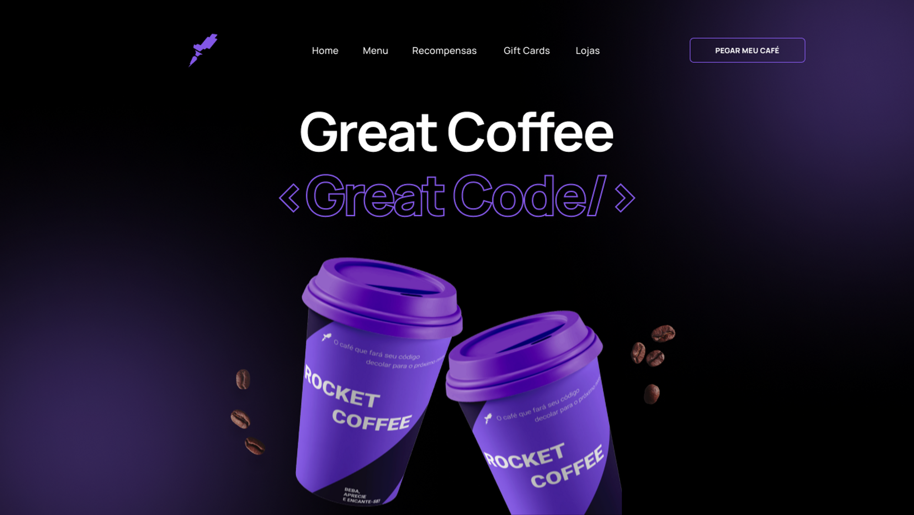

# RocketCoffee Page
Projeto proposto na plataforma da **Rocketseat** para desenvolver as habilidades nas seguintes tecnologias:

* HTML
* CSS
* JAVASCRIPT

## :dart: Objetivo do projeto
Desenvolver uma homepage para uma marca de café, tendo como base o seguinte layout:

## :thumbsup: Resultado final
<h3>Quer ver :eyes: como ficou o resultado final? 
da uma olhada no link da página: :point_down:</h3>
<h3>:smirk::point_right: <a href="https://alvaronascimento04.github.io/rocketcoffee-page" target="_blank">RocketCoffee Page</a></h3>